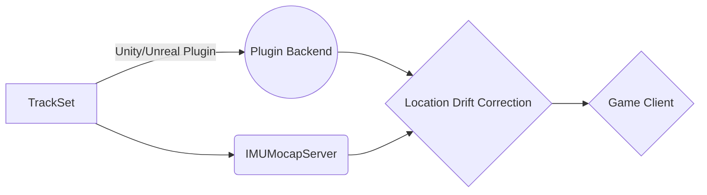

# IMUMocap V1

Hi! Welcome to the first iteration of the imu mocap system. these trackers run just like the **SlimeVr Full Body Trackers** but with more integration with unity and unreal engine directly with dedicated plugins for the game engines. 

# How IMUMocap Works
Our system works just like slimes with a few key differences. our system integrates directly with the game engine not running through systems like steam vr that can if the link ever breaks with the steam vr system you will loose tracking. we don't do that we allow game developers to add it directly so if steam crashes the trackers don't stop tracking and sending data to the game. We Do also offer a stream vr plugin for the programs that require this.

## How to make your own IMUMocap track set

It is very easy to make your own track set as **SlimeVr** uses the same hardware they where the inspiration for this project. so you can load our system on to your trackers and go to the races. the track set works with 17 track points that are running mpu-9250 imus and soon with imu additions for bmi imus of all kinds and bno too [Check Slime VR Out](https://github.com/SlimeVR/)

## How To Build our firmware

**Software Not Fully Ready This Section Will Be Updated Within The Week**

# Synchronization / Calibration

**Software Not Fully Ready This Section Will Be Updated When A Easier Gui Calibration Method Is Created.**

## How The Server Connects To The TrackSet 

